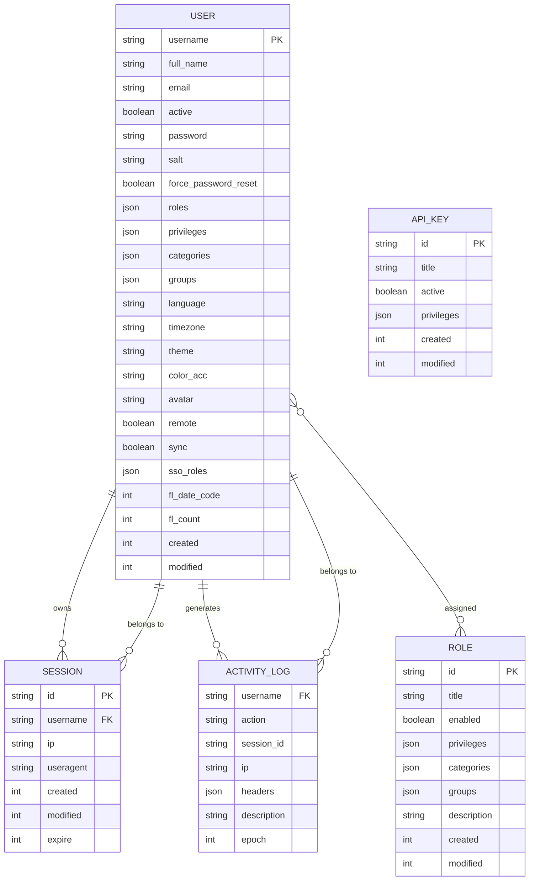

# xyOps — Full Database ERD

> **Storage engine:** `better-sqlite3` — one physical table (`records`) with two columns: `path TEXT PRIMARY KEY` and `data TEXT` (JSON blob). Every entity below is a row in that table, addressed by a slash-delimited key path.

---

## Domain legend

| Domain | Entities |
|---|---|
| Identity & Access | `USER` `SESSION` `ROLE` `API_KEY` `ACTIVITY_LOG` |
| Scheduling | `CATEGORY` `PLUGIN` `CHANNEL` `EVENT` |
| Execution | `JOB` `WORKFLOW_STATE` `BUCKET` |
| Infrastructure | `SERVER` `SERVER_GROUP` `MONITOR` |
| Observability | `ALERT_DEF` `ALERT_INSTANCE` `TIMELINE` `SNAPSHOT` |
| Operations | `TICKET` `GLOBAL_STATE` |

---

## Entity-Relationship Diagram

```mermaid
erDiagram

  %% ── Identity & Access ──────────────────────────────────

  USER {
    string  username            PK
    string  email
    boolean active
    string  password
    string  salt
    json    roles
    json    privileges
    json    categories
    json    groups
    string  timezone
    string  theme
    boolean remote
    boolean force_password_reset
    int     fl_count
    int     created
    int     modified
  }

  SESSION {
    string  id                  PK
    string  username            FK
    string  ip
    string  useragent
    int     created
    int     modified
    int     expire
  }

  ROLE {
    string  id                  PK
    string  title
    boolean enabled
    json    privileges
    json    categories
    json    groups
    string  description
    int     created
    int     modified
  }

  API_KEY {
    string  id                  PK
    string  title
    boolean active
    json    privileges
    int     created
    int     modified
  }

  ACTIVITY_LOG {
    string  username            FK
    string  action
    string  session_id
    string  ip
    string  description
    int     epoch
  }

  %% ── Scheduling ─────────────────────────────────────────

  CATEGORY {
    string  id                  PK
    string  title
    json    default_actions
    json    default_limits
    int     created
    int     modified
  }

  PLUGIN {
    string  id                  PK
    string  title
    string  script_path
    json    params_schema
    boolean enabled
    int     uid
    int     gid
    int     created
    int     modified
  }

  CHANNEL {
    string  id                  PK
    string  title
    json    actions
    int     max_per_day
    int     created
    int     modified
  }

  EVENT {
    string  id                  PK
    string  title
    string  type
    boolean enabled
    string  category_id         FK
    string  plugin_id           FK
    json    params
    json    triggers
    json    limits
    json    actions
    json    workflow
    int     created
    int     modified
  }

  %% ── Execution ──────────────────────────────────────────

  JOB {
    string  id                  PK
    string  event_id            FK
    string  hostname            FK
    string  bucket_id           FK
    int     code
    int     elapsed
    int     pid
    string  description
    int     created
    int     modified
  }

  WORKFLOW_STATE {
    string  id                  PK
    string  job_id              FK
    json    active_nodes
    json    sub_jobs
    json    loop_counters
    json    node_results
    int     created
    int     modified
  }

  BUCKET {
    string  id                  PK
    string  title
    json    data
    string  file_path
    int     created
    int     modified
  }

  %% ── Infrastructure ─────────────────────────────────────

  SERVER {
    string  hostname            PK
    string  label
    string  ip
    string  os
    string  arch
    string  xysat_version
    boolean connected
    json    groups
    int     created
    int     modified
  }

  SERVER_GROUP {
    string  id                  PK
    string  title
    string  regex
    json    default_actions
    int     created
    int     modified
  }

  MONITOR {
    string  id                  PK
    string  title
    string  expression
    json    graph_config
    int     created
    int     modified
  }

  %% ── Observability ──────────────────────────────────────

  ALERT_DEF {
    string  id                  PK
    string  title
    string  expression
    string  monitor_id          FK
    int     sustain
    json    actions
    json    server_scope
    int     created
    int     modified
  }

  ALERT_INSTANCE {
    string  id                  PK
    string  alert_id            FK
    string  server              FK
    boolean active
    json    groups
    int     created
    int     modified
  }

  TIMELINE {
    string  server              FK
    string  monitor_id          FK
    string  granularity
    int     date
    json    totals
    int     count
    json    alerts
  }

  SNAPSHOT {
    string  id                  PK
    string  server              FK
    string  type
    json    processes
    json    connections
    json    metrics
    int     created
  }

  %% ── Operations ─────────────────────────────────────────

  TICKET {
    string  id                  PK
    string  subject
    string  status
    string  type
    json    assignees
    json    tags
    json    linked_jobs
    json    linked_alerts
    int     created
    int     modified
  }

  GLOBAL_STATE {
    string  singleton           PK
    int     next_ticket_num
    json    watches
    int     alert_snooze
    boolean dirty
    int     modified
  }

  %% ── Relationships ──────────────────────────────────────

  USER             ||--o{   SESSION          : "has"
  USER             ||--o{   ACTIVITY_LOG     : "generates"
  USER             }o--o{   ROLE             : "assigned"
  ROLE             }o--o{   CATEGORY         : "scoped to"
  ROLE             }o--o{   SERVER_GROUP     : "scoped to"
  CATEGORY         ||--o{   EVENT            : "groups"
  PLUGIN           ||--o{   EVENT            : "runs"
  EVENT            }o--o{   SERVER_GROUP     : "targets"
  EVENT            ||--o{   JOB              : "spawns"
  SERVER           ||--o{   JOB              : "executes"
  JOB              |o--o|   WORKFLOW_STATE   : "tracked by"
  JOB              }o--o|   BUCKET           : "outputs to"
  JOB              }o--o{   TICKET           : "linked to"
  WORKFLOW_STATE   ||--o{   JOB              : "sub-jobs"
  SERVER           }o--o{   SERVER_GROUP     : "member of"
  SERVER           ||--o{   TIMELINE         : "metrics"
  SERVER           ||--o{   ALERT_INSTANCE   : "fires on"
  SERVER           ||--o{   SNAPSHOT         : "captured in"
  MONITOR          ||--o{   TIMELINE         : "tracked in"
  MONITOR          ||--o{   ALERT_DEF        : "triggers"
  ALERT_DEF        ||--o{   ALERT_INSTANCE   : "fires as"
  ALERT_INSTANCE   }o--o{   TICKET           : "linked to"
  CHANNEL          }o--o{   ALERT_DEF        : "notifies via"
  CHANNEL          }o--o{   CATEGORY         : "default for"
```



---

## Storage key map

| Entity | Storage key pattern | Structure |
|---|---|---|
| `USER` | `users/<username>` | record |
| `SESSION` | `sessions/<id>` | record |
| `ROLE` | `global/roles` | list |
| `API_KEY` | `global/api_keys` | list |
| `ACTIVITY_LOG` | `security/<username>` | list |
| `CATEGORY` | `global/categories` | list |
| `PLUGIN` | `global/plugins` | list |
| `CHANNEL` | `global/channels` | list |
| `EVENT` | `global/events` | list |
| `JOB` | `jobs/<id>` | record |
| `WORKFLOW_STATE` | `workflows/<id>` | record |
| `BUCKET` | `buckets/<id>` | record |
| `SERVER` | `servers/<hostname>` | record |
| `SERVER_GROUP` | `global/groups` | list |
| `MONITOR` | `global/monitors` | list |
| `ALERT_DEF` | `global/alerts` | list |
| `ALERT_INSTANCE` | `unbase/alerts/<id>` | unbase index |
| `TIMELINE` | `timeline/<granularity>/<server>/<monitor>` | record |
| `SNAPSHOT` | `snapshots/<id>` | record |
| `TICKET` | `tickets/<id>` | record |
| `GLOBAL_STATE` | `global/state` | record (singleton) |

---

## Design notes

**`json` fields replace junction tables.** Fields like `user.roles[]`, `user.privileges{}`, `server.groups[]`, and `event.workflow{}` are embedded JSON — not foreign keys to separate tables. xyOps has no junction tables. Many-to-many relationships (`USER ↔ ROLE`, `SERVER ↔ SERVER_GROUP`, `ROLE ↔ CATEGORY`) are all resolved by arrays inside the owning record.

**`WORKFLOW_STATE` creates a self-referential loop with `JOB`.** A workflow is a `JOB` with `type: 'workflow'`. That job owns a `WORKFLOW_STATE` whose `sub_jobs{}` map contains more `JOB` IDs. Sub-jobs can themselves be workflows, making nesting theoretically unbounded.

**`TIMELINE` has no single primary key.** It is addressed by a composite path: `timeline/<granularity>/<server>/<monitor_id>`. The four granularity levels are `hourly`, `daily`, `monthly`, and `yearly`.

**`GLOBAL_STATE` is a singleton.** One row at `global/state`. No FK relationships point into it. It is a shared mutable runtime scratchpad for the scheduler.

**`ALERT_INSTANCE` lives in the Unbase index**, not the main KV namespace. Its records are stored under `unbase/alerts/*` as part of the inverted search index, not as plain `records` rows.

---

## IAM service — focused ERD

Identity, Access Management, and session security only. All five entities, every field, and all relationships including the embedded privilege/scope resolution chain.



### Privilege resolution flow

```
USER.privileges{}
        +
USER.roles[] ──► ROLE.privileges{}  (only where ROLE.enabled = true)
        +
USER.roles[] ──► ROLE.privileges{}  (second role, union — never subtract)
        ↓
  effective_privileges{}
        ↓
  admin: true?  ──► bypass all checks
        ↓
  privilege gate (e.g. run_events: true?)  ──► pass / deny
        ↓
  category scope: USER.categories[] ∩ event.category
        ↓
  group scope:    USER.groups[] ∩ event.target_groups[]
```

### Storage keys — IAM service only

| Entity | Key pattern | Type | Note |
|---|---|---|---|
| `USER` | `users/<username>` | record | Username normalized to lowercase |
| `SESSION` | `sessions/<id>` | record | 18-char random alphanumeric ID |
| `ROLE` | `global/roles` + `global/roles/0`, `/1`… | list | Paginated linked-list |
| `API_KEY` | `global/api_keys` + pages | list | Key `id` is the actual secret value |
| `ACTIVITY_LOG` | `security/<username>` + pages | list | Prepended (newest first) |

### Field notes

| Field | Entity | Why it exists |
|---|---|---|
| `password` | USER | bcrypt hash — plaintext never stored. Stripped from all API responses. |
| `salt` | USER | Random hex seed passed into bcrypt. Stripped from all API responses. |
| `fl_date_code` | USER | `YYYYMMDD` int — resets `fl_count` each new day without a separate table. |
| `fl_count` | USER | Failed login counter for the current day. Triggers lockout at config threshold. |
| `force_password_reset` | USER | Admin-only flag. Cannot be set via `POST /api/user_settings`. |
| `roles[]` | USER | References `ROLE.id` values. Resolved at request time — not denormalized. |
| `privileges{}` | USER / ROLE / API_KEY | Boolean map. Additive union across user + all enabled assigned roles. |
| `categories[]` | USER / ROLE | Restricts which event categories are visible. Empty = all. |
| `groups[]` | USER / ROLE | Restricts which server groups can be targeted. Empty = all. |
| `remote` | USER | `true` = account identity managed by SSO provider. |
| `sync` | USER | `true` = fields overwritten from IdP on every login. |
| `sso_roles[]` | USER | Raw IdP group names before the `sso.role_map` translation. |
| `expire` | SESSION | `created + (session_expire_days × 86400)`. Checked on every `loadSession()` call. |
| `headers{}` | ACTIVITY_LOG | Full HTTP headers snapshot at event time. `user-agent` parsed by `useragent-ng` before display. |
| `enabled` | ROLE | `false` = role contributes nothing even if assigned to a user. |